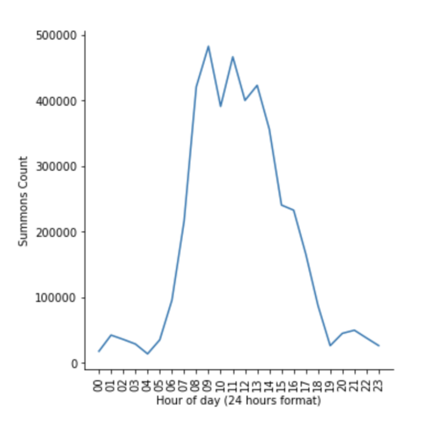
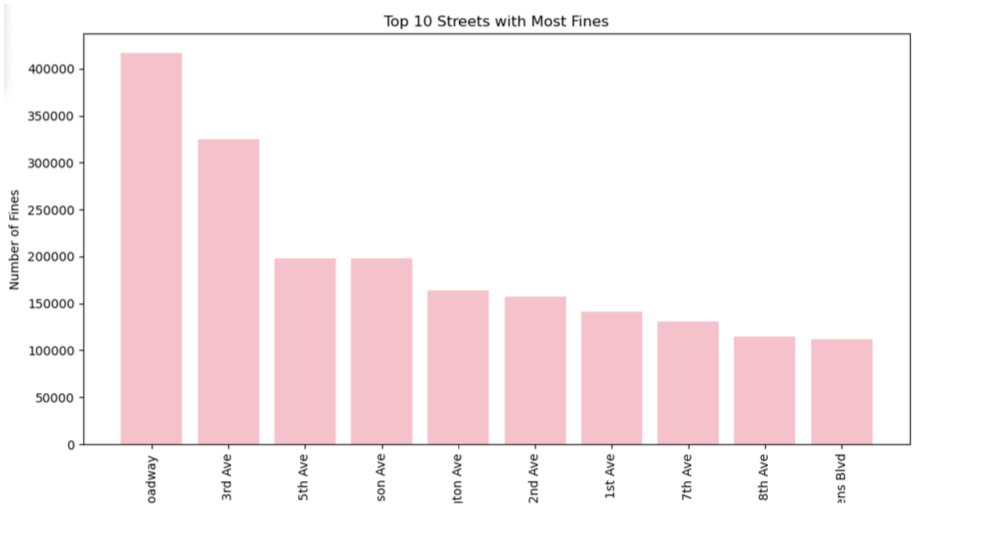

# NYC Parking Violations Analysis and Predictions

🚗 **Explore New York City's Parking Trends, Policies, and Revenue Predictions**

---

## 🎯 Project Overview
New York City issues millions of parking tickets annually, generating significant revenue but also highlighting inefficiencies in urban parking management. This project analyzes NYC parking violation data using big data tools and machine learning to uncover trends, predict revenue, and offer actionable insights.

---

## 💡 Motivation
With over 14GB of data spanning millions of records, understanding parking violations is key to improving urban mobility, compliance, and revenue generation. This project:
- Identifies violation trends by time, location, and vehicle type.
- Analyzes precinct-level enforcement strategies.
- Predicts parking violation revenue using machine learning models.

---

## 🌟 Key Features
- **Data Preprocessing**: Cleaned, merged, and transformed 14GB of raw data.
- **Exploratory Data Analysis (EDA)**: Identified violation trends by hour, street, and agency.
- **Machine Learning**: Built models for revenue prediction and insights.
- **Scalable Architecture**: Used PySpark and Google Cloud Platform (GCP) for large-scale data processing.

---

## 🛠️ Tools and Technologies
- **Programming Languages**: Python
- **Big Data Framework**: PySpark
- **Cloud Platform**: Google Cloud Platform (GCP)
- **Data Visualization**: Matplotlib
- **Machine Learning**: Scikit-Learn
---

## 🔄 Data Pipeline
1. **Data Loading**: Imported raw data from GCP.
2. **Cleaning and Transformation**:
   - Removed placeholder values (`99`, `999`).
   - Filled missing data with appropriate defaults.
   - Engineered features like `Year`, `Month`, `Day`, and `Hour`.
3. **Feature Engineering**:
   - Encoded categorical variables using `StringIndexer`.
   - Extracted actionable insights from large datasets.

---

## 🤖 Machine Learning Models
We used several machine learning models for revenue prediction and insights:
1. **Linear Regression (L2 Regularization)**: Achieved the best performance with an R² of 0.87.
2. **Decision Tree Regressor**: Moderate performance (R² = 0.53).
3. **Gradient Boosted Trees (GBT)**: High predictive accuracy with moderate variance.
4. **Random Forest Regressor**: Struggled with variance issues.
5. **LASSO Regression**: Feature selection with moderate accuracy.

---

## 📊 Results and Insights
- **Peak Enforcement Hours**: Most tickets issued between 7 AM - 3 PM.

- **Top Streets for Violations**: Broadway leads with the highest fines.

- **Revenue Estimation**:
  - Precinct 0 generated $197 million in estimated revenue.
  - Significant revenue variations between precincts highlight enforcement disparities.
- **Model Performance**:
  - Linear Regression outperformed other models with the lowest RMSE of 394,986

